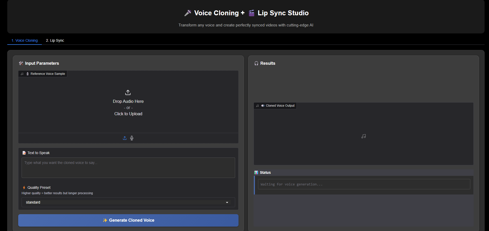

# Voice Cloning and Lip Syncing with Tortoise TTS and Wav2Lip



*Seamless integration of voice cloning and lip synchronization technologies*

## Project Overview
This project integrates voice cloning using [Tortoise TTS](https://github.com/neonbjb/tortoise-tts) and lip-syncing using [Wav2Lip](https://github.com/Rudrabha/Wav2Lip) into a single Gradio interface. The user can input a reference audio and text to clone a voice, and optionally sync the generated audio to a video.


## Problem Statement

### Key Challenges in Voice Dubbing

1. **Lip-Sync Inaccuracy**  
   Existing solutions struggle to precisely align phoneme timing with viseme formations, resulting in observable desynchronization between audio and video streams.

2. **Voice Characteristic Preservation**  
   Current voice cloning systems often fail to maintain:
   - Speaker identity features (timbre, pitch contours)
   - Emotional prosody
   - Language-specific articulatory patterns

3. **Computational Requirements**  
   High-fidelity neural voice cloning and lip-sync typically demand:
   - Specialized GPU hardware
   - Complex pipeline orchestration
   - Manual post-processing

### Technical Approach

Our implementation addresses these challenges through:

1. **Precision Lip-Synchronization**  
   Wav2Lip's adversarial framework generates frame-accurate mouth movements conditioned on Mel-frequency cepstral coefficients.

2. **Context-Aware Voice Cloning**  
   Tortoise TTS employs:
   - Reference encoder for speaker embedding
   - Diffusion-based prosody modeling
   - Attention-based duration prediction

3. **Optimized Inference Pipeline**  
   Modular architecture enables:
   - Hardware-agnostic execution
   - Batch processing capabilities
   - Quality-time tradeoff parameters

## Features

- Voice cloning using Tortoise TTS with reference audio and input text
- Lip-syncing the cloned voice to a face video using Wav2Lip
- Minimal Gradio-based interface for user interaction
- Example assets provided for quick testing

## Run on Kaggle

You can try this project directly on Kaggle without any local setup:

**[Open in Kaggle →][(https://www.kaggle.com/code/parihasakreddy/voiceclone-lipsync-ipynb)](https://www.kaggle.com/code/parihasakreddy/voiceclone-lipsync-ipynb))**


**After running the notebook:**

Click on the public URL generated by Gradio, which looks like https://******************.gradio.live

**Notes:**
- Initial loading may take approximately 3 minutes.
- Use the files in the `assets/` directory to test the pipeline.
- Voice cloning typically takes 2–3 minutes for short text.
- Lip-syncing may not yield good results for very short voice samples. For best results, test lip-syncing with longer audio.
- Alternatively, lip-syncing can be tested independently using this notebook:  
  **[Wav2Lip public notebook →][(https://www.kaggle.com/USERNAME/wav2lip-notebook-link](https://www.kaggle.com/code/parihasakreddy/lipsync-only))**

## Usage

## Local Installation

### Requirements
- NVIDIA GPU with at least 8GB VRAM (recommended)
- CUDA 11.x installed
- Python 3.8 or higher
- FFmpeg installed (for video processing)

### Installation Steps

```bash
git clone https://github.com/parihasaa/voice-clone-and-lip-sync.git
cd voice-clone-lip-sync

# Clone Wav2Lip repository
git clone https://github.com/Rudrabha/Wav2Lip.git

# Install dependencies
pip install -r requirements.txt

# Important: Edit paths in app.py before running
# Set correct paths for Wav2Lip directory and other resources
